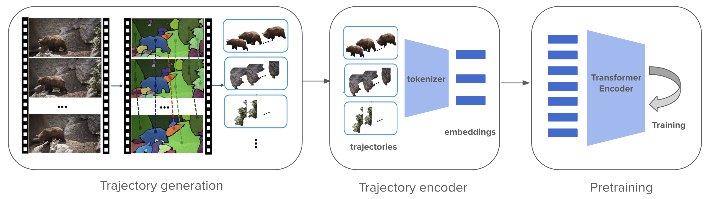

# TrajViT

[One Trajectory, One Token: Grounded Video Tokenization via Panoptic Sub-object Trajectory](https://arxiv.org/abs/2505.23617), ICCV 2025


Official PyTorch code for TrajViT, an efficient video tokenization paradigm and a video transformer encoder. TrajViT tokenizes video with panoptic sub-object trajectories, significantly surpassing traditional way of space-time patch tokenization by a large margin in video understanding tasks while using 10x less tokens. 

<p align="center">

</p>

#### TODO
- [ ] support joint training on image data
- [ ] support attentive probing evaluations on action classification and localization tasks
- [ ] release model checkpoints
- [ ] instruction on using panda-70m training set

## Setup

The required packages contain two parts: one for generating trajectories from video, one for training video vit encoder. Below are detailed steps to setup two parts of packages jointly in a conda environment.
```bash
# create and active conda environment
conda create --name trajvit python=3.10
conda activate trajvit
# go to traj_gen folder to install trajectory generation packages
cd traj_gen/
pip install -e ".[dev]"
# go back to repository folder to install the remaining packages
cd ..
pip install -r requirements.txt 
# download sam2-small checkpoint
wget -P checkpoints/ https://dl.fbaipublicfiles.com/segment_anything_2/092824/sam2.1_hiera_small.pt
```

In your .bashrc file, set the environment variables:
```bash
export SL_EXP_DIR="<path-to-trajvit-repo>/results"
export SL_DATA_DIR="<path-to-trajvit-repo>/data"
```
These variables are accessed by the yaml files in the [configs/](configs) directory and the shell scripts in [entry/run.sh](entry/run.sh).

[Optional] Our codebase support using [wandb](https://wandb.ai/) to monitor training. If you want to use wandb, you will need to set up it following [this very short instruction](https://docs.wandb.ai/quickstart#1.-set-up-wandb), and also set `wandb.enable` in the [configs](configs) to be `True`.


## Demo
We wrote a demo code in [demo.py] that demonstrates how our model can be used to inference a video. Simply run
```python
python demo.py --video_path example/example.mp4
```
to get the result. If you want to visualize the generate trajectories, you can additionally pass in argument:
```bash
python demo.py --video_path example/example.mp4 --visualize_tracks
```


## Download training/eval data and pre-generate trajectories

It is recommended to save data annotation files under `${SL_DATA_DIR}`. For example, the config file [configs/pretrain.yaml](configs/pretrain.yaml) assume `${SL_DATA_DIR}/metadata` is the directory containing all data annotation files. Below, We use [MSRVTT dataset](https://www.microsoft.com/en-us/research/wp-content/uploads/2016/06/cvpr16.msr-vtt.tmei_-1.pdf) as demonstration. 

#### 1. Download videos 
Depending on the dataset you want to train/evaluate, you will download videos from different sources. For MSRVTT, you can download their videos by
```bash
wget -P data/videodata/ https://www.robots.ox.ac.uk/~maxbain/frozen-in-time/data/MSRVTT.zip
unzip data/videodata/MSRVTT.zip -d data/videodata/
```

#### 2. Format annotation file 
The annotation file is in `json` format, which can be loaded as a list of dictionaries. Each dictionary is `{'image': path_to_image, 'caption': image_caption}` for image-text dataset, and is `{'video': path_to_video, 'caption': video_caption}` for video-text dataset. We already provided train&eval annotation files for MSRVTT dataset in [data/metadata/] folder.

#### 3. Modify config file
In [configs/pretrain.yaml](configs/pretrain.yaml), add name and paths to your annotation file under the `available_corpus` entry. For example  `my_new_dataset: [path_to_json, path_to_video_directory, video]`.

#### 4. Pre-generate trajectories
it is recommended to pre-generate trajectories for all data and save them to disk, so you won't need to generate trajectories again for every model inference. The trajectory generation script takes data annotation json file as input. For example, to generate trajectories for MSRVTT training split, simply need to run:
```bash
cd traj_gen
python training/generate_traj.py --json_path ../data/metadata/msrvtt_train.json --video_dir ../data/videodata/MSRVTT/videos/all/ --use_key_frame
```
The eval split can be generated similarly.
We also support splitting dataset into several splits, to run them separately and speed up trajectory generation. The command is:
```bash
python training/generate_traj.py --split 1 --total_split 10 --json_path ../data/metadata/msrvtt_train.json --video_dir ../data/videodata/MSRVTT/videos/all/ --use_key_frame 
```


## Pre-Training
Launch pre-training with the following command. This assumes running on 8 gpus.
```bash
cd entry
bash run.sh --task pretrain --train_corpus msrvtt_train --exp_name debug_exp --ngpus 8 --nnode 1 --model trajvit --log_wandb
```
The full command-line arguments you can specify can be seen in [entry/run.sh](entry/run.sh). `--model` can be either `trajvit` or the baseline `vit3d`.


## Evaluation
For zero-shot retrieval evaluation, run
```bash
cd entry
bash run.sh --task zero_shot_eval --test_corpus msrvtt_test --model trajvit --ckpt <path-to-model-checkpoint>  --log_wandb 
```
We will update the repo soon with evaluation scripts on more tasks.

## Acknowledgement
This code used resources from [singularity](https://github.com/jayleicn/singularity), [transformers](https://github.com/huggingface/transformers), [ALBEF](https://github.com/salesforce/ALBEF), [ClipBERT](https://github.com/jayleicn/ClipBERT), [frozen](https://github.com/m-bain/frozen-in-time). The code is implemented using PyTorch. We thank the authors for open-sourcing their awesome projects.

## Bibtex
If you found our paper or code useful, please cite:

    @article{zheng2025one,
        title={One Trajectory, One Token: Grounded Video Tokenization via Panoptic Sub-object Trajectory},
        author={Zheng, Chenhao and Zhang, Jieyu and Salehi, Mohammadreza and Gao, Ziqi and Iyengar, Vishnu and Kobori, Norimasa and Kong, Quan and Krishna, Ranjay},
        journal={arXiv preprint arXiv:2505.23617},
        year={2025}
    }

